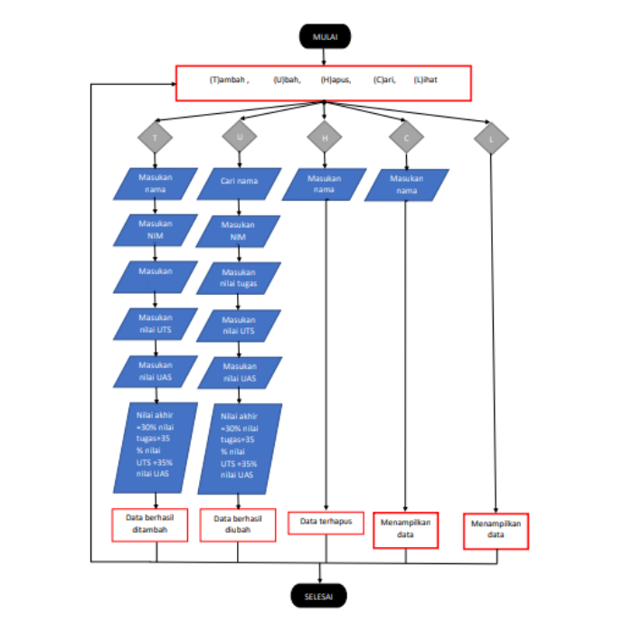

# Tugas pertemuan 10


<br>

# Latihan 1

1. Membuat data kontak awal
```sh
    b={'ari':'085267888','dina':'087677776'}
```
2. Menampilkan kontak ari
```sh
    print(b['ari'])
```
3. Menambah kontak atas nama riko
```sh
    b['riko']='087654544'
```
4. Mengubah kontak dina
```sh
    b['dina']='088999776'
```
5. Tampilkan semua nama
```sh
    print(b.keys())
```
6. Tampilkan semua nomor
```sh
    print(b.values())
```
7. Menampilkan semua nama dan nomor
```sh
    print(b)
```
8. Menghapus kontak dina
```sh
    del b['dina']
```
# Output


# Tugas Praktikum


# Flowchart



# Tugas Praktikum
1. Membuat looping agar program terus berjalan
```sh
while True:
    
    c = input("\n(L)ihat, (T)ambah, (U)bah, (H)apus, (C)ari, (K)eluar: ")
```

2. Membuat pilihan , sebagai contoh apabila memilih (t) akan menambah data:
```sh
if (c.lower() == 't'):
        
        print('\nTambah Data Mahasiswa Baru')
        
        nama= input("Masukkan Nama\t\t: ")
        
        nim= input("Masukkan NIM\t\t: ")
        
        nilaiTugas= int(input("Masukkan Nilai Tugas\t: "))
        
        nilaiUts= int(input("Masukkan Nilai UTS\t: "))
        
        nilaiUas= int(input("Masukkan Nilai UAS\t: "))
        
        nilaiAkhir= (0.30 * nilaiTugas) + (0.35 * nilaiUts) + (0.35 * nilaiUas)
        
        dataMhs[nama]= nim, nilaiTugas, nilaiUts, nilaiUas, nilaiAkhir
        print("\nData Berhasil Ditambahkan!")
```
3. Melakukan percabangan if (elif) untuk melaksanakan pilihan yang lain:
```sh
elif (c.lower() == 'u'):
        
        print('\nMengedit Data Mahasiswa')
        
        nama = input("Masukkan Nama: ")
        
        if nama in dataMhs.keys():
        
            nim= input("Masukkan NIM Baru\t: ")
            
            nilaiTugas= int(input("Masukkan Nilai Tugas\t: "))
            
            nilaiUts= int(input("Masukkan Nilai UTS\t: "))
            
            nilaiUas= int(input("Masukkan NIlai UAS\t: "))
            
            nilaiAkhir= (0.30 * nilaiTugas) + (0.35 * nilaiUts) + (0.35 * nilaiUas)
            
            dataMhs[nama] = nim, nilaiTugas, nilaiUts, nilaiUas, nilaiAkhir
            print("\nData Berhasil Di Update!")
```
4. Else untuk apabila salah memasukan pilihan inputan
 ```sh
 else:
        
        print("Pilih menu yang tersedia: ")
```
# Output

